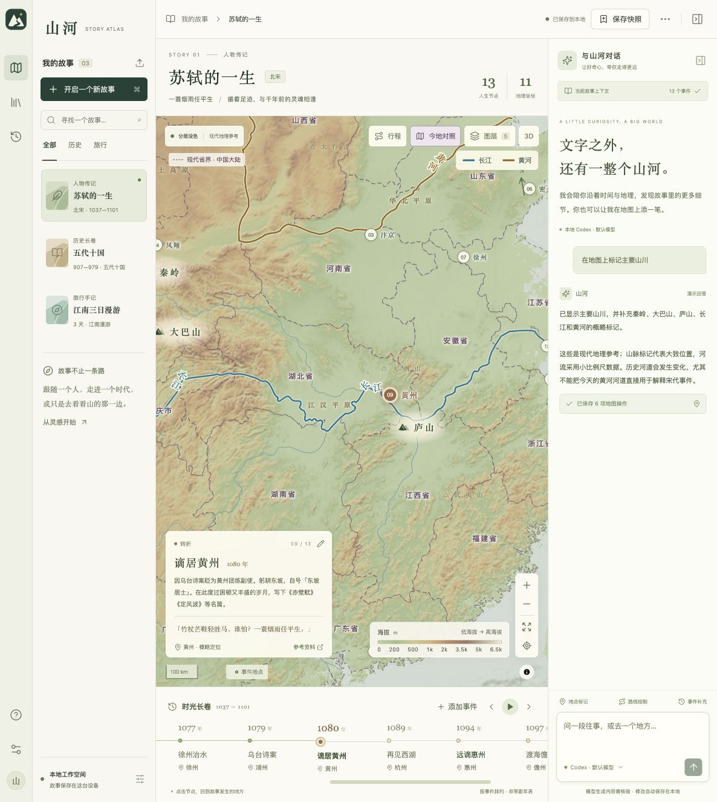
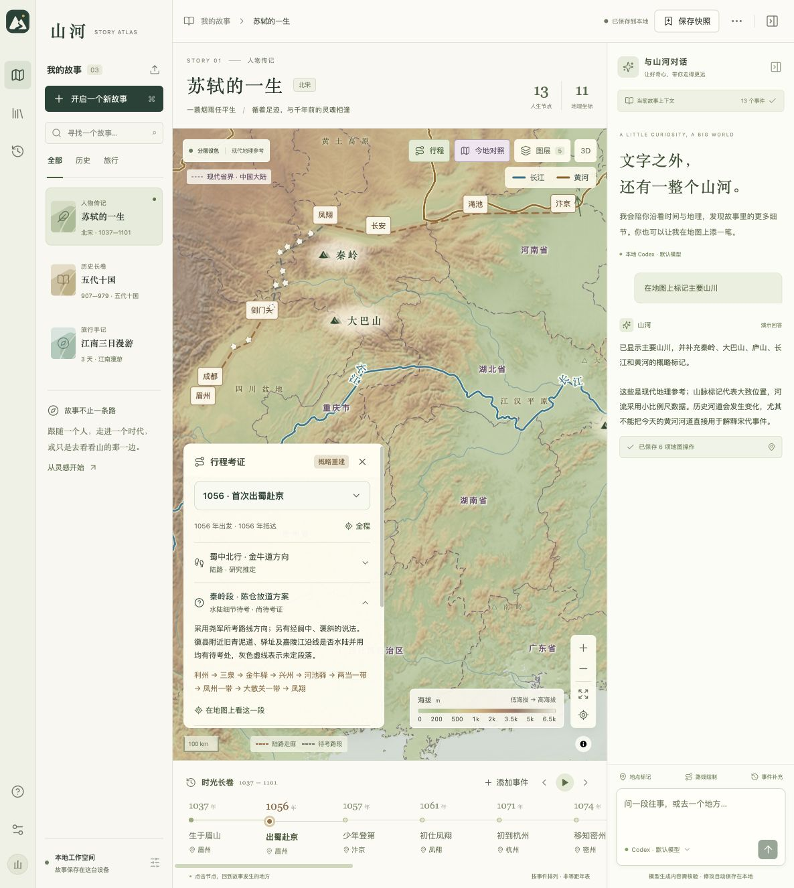

<div align="center">


<h1>山河 · Shanhe</h1>

<p><strong>在地图上，读懂每一个故事。</strong><br />
<sub>Story Atlas — history, biographies, and journeys through maps, timelines, and AI.</sub></p>

<p><code>本地优先</code> &nbsp; <code>macOS / Web</code> &nbsp; <code>Codex / 模型 API</code></p>

<p>
  <a href="https://hsiaosiyuan0.github.io/shanhe/"><strong>在线体验 ↗</strong></a> ·
  <a href="#features">产品功能</a> ·
  <a href="#journeys">行程考证</a> ·
  <a href="#local-agent">本地 Agent</a> ·
  <a href="#quick-start">开始体验</a> ·
  <a href="#docs">项目文档</a>
</p>

</div>



<p align="center"><sub>桌面版真实界面 · 苏轼的一生 · 地形、事件与对话共处一个工作台</sub></p>

读苏轼的一生，除了年份与作品，我们还想知道：眉山在哪里，赴京要经过哪些山川，黄州又在今天的什么地方。

山河把这些线索放进同一个 **Story**。沿着时间线查看事件，在地图上理解地理背景，再通过对话补充地点、路线与笔记。探索的结果会留在故事里，下次打开继续。

<a id="features"></a>

## 从一个故事开始

| 人物的一生                                       | 一个历史时代                               | 一段旅行构想                                     |
| :----------------------------------------------- | :----------------------------------------- | :----------------------------------------------- |
| **苏轼的一生**                                   | **五代十国**                               | **江南三日漫游**                                 |
| 把人生节点放回发生的地方，阅读仕途、迁徙与创作。 | 把重大事件放进时间线，对照地点与周围地势。 | 整理每天的停留点，用路线串起旅途，留下地点笔记。 |

三个示例开箱可用，也可以创建空白故事，从自己的主题开始。自由主题可以手动整理，也可以在桌面版连接模型补充内容。

### 时间与地点，一起读

点击「时光长卷」中的节点，地图会定位到相应地点，展开事件内容。可以播放时间线，也可以手动添加、编辑事件，把人物、时间、地点和一句诗放在一起。

### 看见山川，也认得今地

- **海拔分层设色**：用颜色和山体明暗呈现高低起伏，配合海拔图例，观察山地、盆地与平原。
- **河道上的名字**：长江、黄河、淮河沿河道着色与标注；点击图例定位，结合淮河理解“淮南、淮北”等地域称谓。
- **自己的河道数据**：在「图层 → 河道数据」导入 GeoJSON，或从目录添加汉江等河流；预览、换色、编辑来源、导出，模型也能读取和修改。[使用说明](docs/RIVER_DATA.md)
- **现代行政区对照**：内置天地图省、市、区县数据，按缩放或图例按钮逐级查看；鼠标移入区域即可高亮完整轮廓。边界与悬停共用同一份数据，公共边界只绘制一次，桌面版无需联网查询区域。版本与精度说明见[行政区数据](docs/ADMIN_DATA.md)。
- **三维地形**：独立切换立体视角，开启后可查询已加载地形的估算高程。

<a id="journeys"></a>

### 一次出行，单独讲清楚

历史行程有自己的出发时间、经过地点和交通方式。山河支持记录陆路、水路与待考分段，每段可以展开说明、定位到地图，并查阅资料依据。

当前示例整理了 **苏轼 1056 年首次出蜀赴京**，采用「金牛道—陈仓故道」研究方案。图上表达的是概略走廊，秦岭支道等分歧会明确标出。人生节点之间的地点关系另有独立图层；旅行规划使用平滑的路线示意。



<p align="center"><sub>历史行程示例 · 概略重建，具体道路仍需考证 · <a href="docs/ROUTE_EVIDENCE.md">查看资料与精度说明</a></sub></p>

<a id="local-agent"></a>

### 和模型一起，把故事继续下去

桌面版与本地 Web 版的探索助手可以读取当前故事，并实际操作地图：**添加事件、标记地点、绘制路线、管理河道数据、调整图层与视角**。文字回答和地图变更一起保存。

```text
在地图上标记主要山川
打开今地对照
添加汉江河道，并用烟紫色显示
聊聊苏轼在黄州的岁月
```

**连接本机 Codex**，可以复用已有登录，自动检测程序、读取可选模型，无需另填 API Key。支持流式回答、工具进度、停止生成，以及每个故事独立续聊。

**连接模型 API**，可以使用兼容 Chat Completions 工具调用协议的服务，也可以连接支持工具调用的 Ollama 模型。

<details>
<summary><strong>查看本地 Agent 连接界面</strong></summary>


</details>

本地 Agent 当前支持 **Codex CLI 0.153+**。程序在本机运行，模型请求仍使用 CLI 的服务配置；当前未启用联网史料核验，模型新增内容会标记为待核验。[连接方法](docs/SETUP.md#连接模型)

### 把探索结果留下来

| 自动保存                                                                                                    | 版本快照                                             | 完整迁移                                                    |
| :---------------------------------------------------------------------------------------------------------- | :--------------------------------------------------- | :---------------------------------------------------------- |
| 编辑自动保存（桌面版 SQLite，在线版 IndexedDB）。桌面版对话与地图修改一起保存，失败或取消时不写入本轮内容。 | 保存故事、对话与地图视角；恢复之前自动备份当前版本。 | 导出事件、路线、标记和聊天为 JSON，导入另一台设备继续探索。 |

导出不包含模型密钥、本机 Agent 会话关联和版本快照。在线版、本地 Web 与桌面版的数据独立，可以通过导入、导出迁移。在线版仅保存在当前浏览器，请导出备份。

<a id="quick-start"></a>

## 开始体验

**直接打开 [在线版](https://hsiaosiyuan0.github.io/shanhe/)**，无需安装。支持故事编辑、地图、快照和浏览器保存。需要 AI 探索时，点击右上角「使用桌面版」，按[安装指引](docs/DESKTOP.md)安装并导入故事继续。[版本差异与部署说明](docs/PAGES.md)

本地运行需要 **Node.js 24+**。克隆仓库后，在项目目录执行：

```sh
npm install
npm run dev
```

打开 **[127.0.0.1:5178](http://127.0.0.1:5178)**。首次运行会自动创建 SQLite 数据库和三个示例故事，不需要单独安装数据库。

未连接模型时，也可以用预设的演示指令体验地图操作。准备自由探索时，打开左下角「模型设置」，选择本地 Codex 或模型 API。

<details>
<summary><strong>作为 macOS App 使用</strong></summary>

在[桌面安装指引](docs/DESKTOP.md)下载 Apple Silicon / Intel 对应的 DMG 或 ZIP，拖入「应用程序」即可使用。正式版本从 Releases 获取，每次 main 更新也会在 Actions 提供测试包。

自行构建需要 macOS、Node.js 24+ 和 Xcode Command Line Tools。

```sh
npm run desktop
```

命令会构建并打开独立的「山河」窗口，桌面外壳自动管理本地后端。Apple Silicon 产物位于 `release/mac-arm64/山河.app`，内置 Node 运行时。

支持 macOS 13.5+，当前包采用 ad-hoc 签名，尚未进行 Apple 公证。Windows / Linux 可以使用带本地后端的 Web 版，暂无对应桌面包。[其他运行与打包方式](docs/SETUP.md#运行)

</details>

<a id="docs"></a>

## 项目文档

前后端通过 HTTP API 分离：**React + TypeScript + Radix UI** 构建工作台，**MapLibre** 渲染地图，**Node.js + Express + SQLite** 管理故事与模型工具。macOS 外壳使用 **Swift / AppKit / WKWebView**。

| 文档                                     | 内容                                                     |
| :--------------------------------------- | :------------------------------------------------------- |
| [在线版与部署](docs/PAGES.md)            | 浏览器保存、故事迁移、版本差异与 GitHub Actions          |
| [桌面自动构建](docs/MACOS_CI.md)         | 双架构产物、版本标签与 GitHub Releases 发布              |
| [桌面版安装](docs/DESKTOP.md)            | macOS 安装、迁移在线故事与连接探索助手                   |
| [安装与配置](docs/SETUP.md)              | Web / macOS 运行、模型连接、环境变量、工程结构与开发命令 |
| [产品与工程设计](docs/ARCHITECTURE.md)   | Story 数据模型、工具能力、组件层、持久化与接口           |
| [本地 Agent 接入](docs/LOCAL_AGENTS.md)  | Codex 连接、会话管理、工具回调与 Multica 调研            |
| [行程资料与精度](docs/ROUTE_EVIDENCE.md) | 苏轼首次赴京的资料来源、研究分歧与绘图方式               |
| [地图数据说明](docs/GEOGRAPHY.md)        | 地理数据来源、联网需求、坐标与精度范围                   |

## 正在完善

当前版本已经可以完成「创建故事 → 阅读地图与时间线 → 对话修改 → 保存与迁移」的完整过程。接下来希望补齐：

- 随年份变化的历史疆界与地理图层。
- 带出处的资料检索、核验与更多历史行程。
- Claude Code、OpenCode 等本地 Agent 适配。
- 路线编辑、事件重排与更多故事整理工具。

**当前底图是现代地理参考，尚不提供按年代变化的历史疆界。** 地图位置和行程服务于故事阅读，不能作为精确古道复原或实际导航。讨论功能、补充史料时，欢迎附上具体故事、地点和参考来源。

---

<p align="center">
  <sub>地图数据：天地图 · Natural Earth · OpenStreetMap / OpenFreeMap / OpenMapTiles · Esri / USGS · Mapzen / AWS<br />
  资料与署名见 <a href="docs/GEOGRAPHY.md">地图数据说明</a> · 截图来自实际运行的山河 App</sub>
</p>
